# گزارش قسمت Profiling

همانطور که در صورت آزمایش تصریح شده‌است در این آزمایش ما می‌مخواهیم با استفاده از ابزار YourKit اقدام به پروفایل گرفتن از برنامه مدنظر کنیم.
در ابتدا مطابق با دستورالعمل داده شده ابزار YourKit را نصب کرده و پس از اضافه IDE به آن آزمایش را انجام می‌دهیم.

در ابتدا عملیات پروفایل‌گیری را بر روی کلاس JavaCup اجرا کرده و در زیر تصاویر مربوط به پروفایل این کلاس را می‌بینیم:
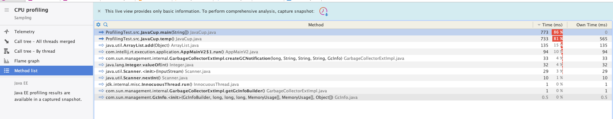

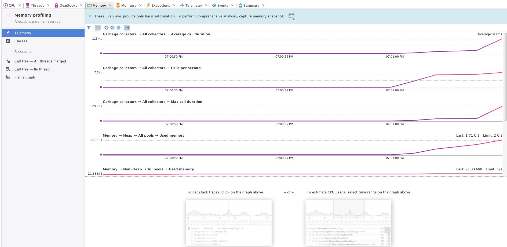

همانطور که در تصاویر مشاهده می‌کنید مصرف CPU, Memory پس از اجرای برنامه افزایش یافته‌است و وقتی در تصویر اول توابع پر مصرف را شناسایی می‌کنید متوجه می‌شویم تابع temp در کلاس JavaCup مصرف زیادی دارد و باید آن‌ را اصلاح کرد.
و وقتی هم برنامه را اجرا می‌کنیم پس از مدتی با خطای java heap space روبرو می‌شویم که مربوط به memory allocation غیرلازم در حلقه‌های این تابع است.

برای بهینه کردن این تابع بهتر است که از arrayList استفاده نکنیم و در تصویر زیر تابع بعد از اعمال تغییرات را می‌بینید:
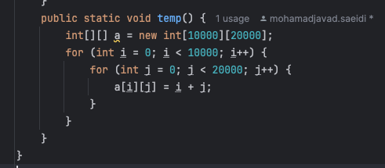

حال پس از این تغییر اقدام به اجرای دوباره برنامه بر روی Yourkit می‌کنیم. و در شکل زیر تصاویر مربوط به مصرف CPU, Memory برنامه را مشاهده‌ می‌کنید:
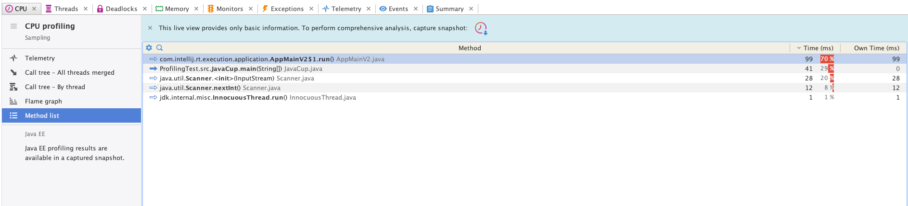

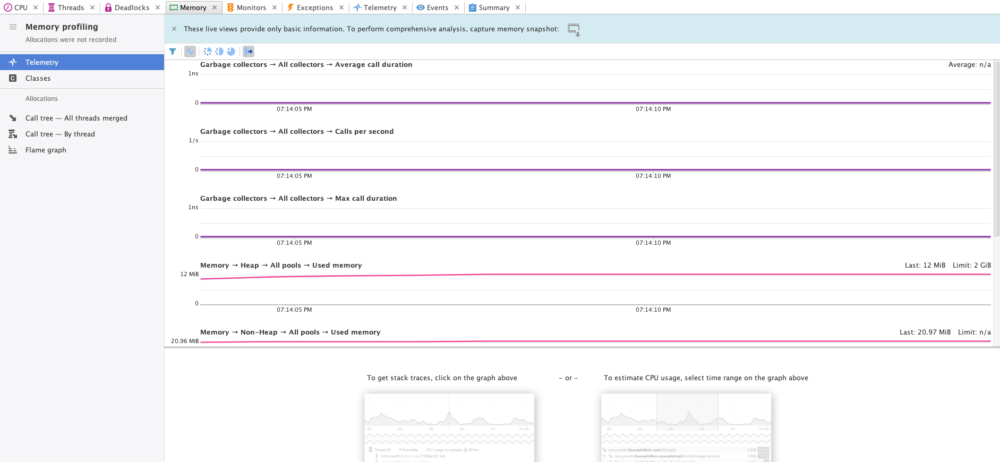

که همانطور که مشاهده می‌شود مشکل برطرف شده و برنامه نیز به درستی اجرا می‌شود.

در ادامه قطعه کد دیگری به برنامه اضافه می‌کنیم و سعی می‌کنیم با استفاده از ابزار YourKit آن را پروفایل کنیم و بهبود دهیم.

یک کلاس جدید به نام CommonElements اضافه می‌کنیم که وظیفه‌ش این است که بین ۲ آرایه از اعداد تعداد المنت‌های مشترک را پیدا کنید و آن را چاپ کند که در تصویر زیر قطعه کد اولیه را مشاهده‌ می‌کنید:
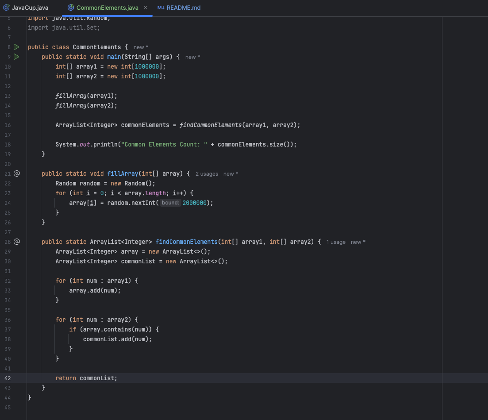

همانطور که در تصویر مشاهده‌کنید در تابع findCommonElements با استفاده از ۲ حلقه سعی میکنیم تعداد المنت‌های مشترک را پیدا کنیم.
حال این برنامه را با استفاده از YourKit آنالیز می‌کنیم که در ادامه تصاویر مربوط به مصرف Cpu, Memory را مشاهده‌ می‌کنید:

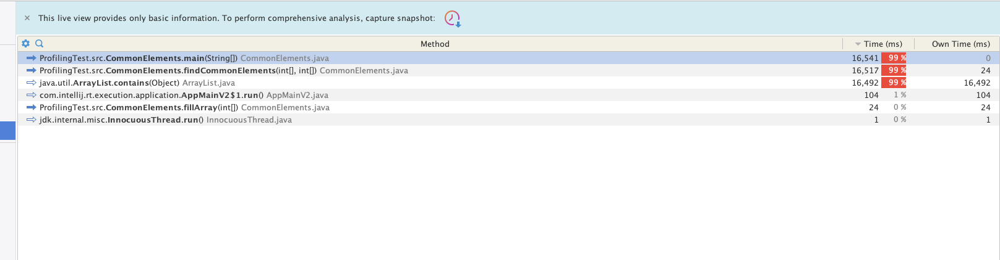

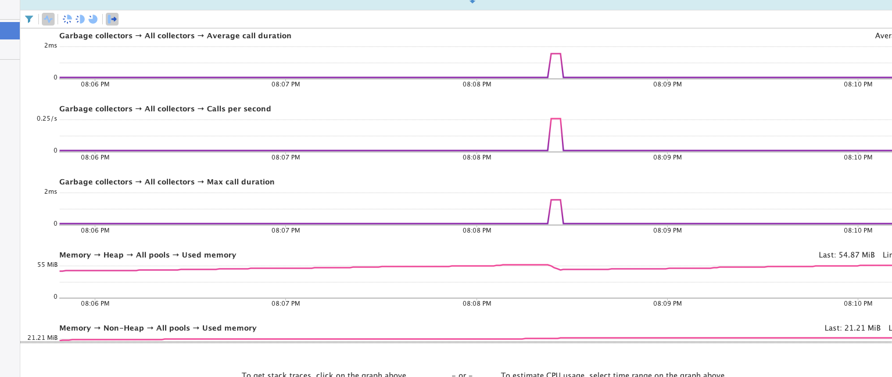

همانطور که در تصویر مشاهده می‌کنید تابع findCommonElement بیشترین مصرف را دارد و برنامه پس از مدتی با خطای java heap size متوقف می‌شود.

حال در ادامه می‌خواهیم برنامه را بهبود دهیم؛ برای این کار ابتدا بجای ArrayList از Set استفاده می‌کنیم و همچنین در ابتدا اجرای برنامه سایر Set را مقدار دهی می‌کنیم که در تصویر زیر کد اصلاح شده را مشاهده می‌کنید:
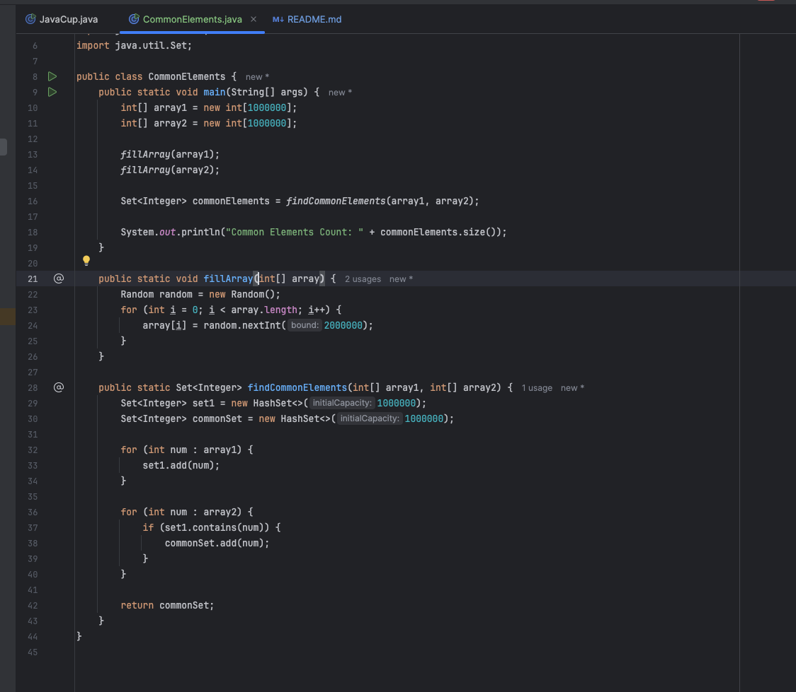

حال دوباره برنامه را اجرا می‌کنیم و مصرف Cpu, Memory آن را بررسی می‌کنیم که تصاویر آن در زیر آمده‌است:

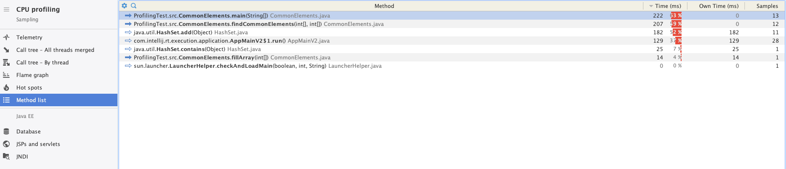

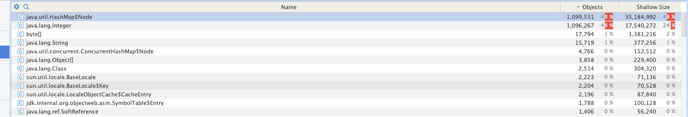

که همانطور که مشاهده می‌کنید مصرف کاهش پیدا کرده و برنامه نیز در مدت کوتاهی اجرا می‌شود و خروجی را چاپ می‌کند.

# گزارش قسمت BDD
# بخش اول (۱)
در تصاویر زیر اجرای مراحل ذکر شده در فایل Example.pdf به ترتیب نشان داده شده است. 

# بخش دوم (۲)

این مشکل به این دلیل است که در رجکس تعریف شده ما اعداد منفی را در نظر نگرفته‌ایم (\\d+) و به همین دلیل موقع اجرای تست‌ها به این ارور میخوریم. برای اصلاح این مسئله کافی است تا رجکس مربوطه را با افزودن یک منفی به صورت اختیاری اصلاح کنیم یعنی هر جا که \\d+ داریم تبدیل به -؟\\d+ میشود. در تصویر انتهایی بخش قبل نیز نسخه‌ی اصلاح شده و سالم قابل مشاهده است که تمامی تست‌ها به درستی پاس شده‌اند.
